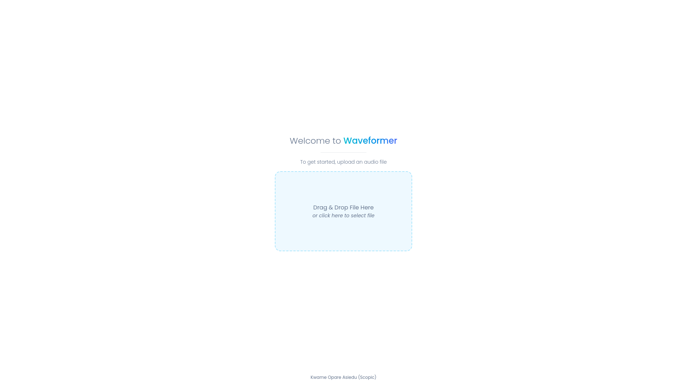
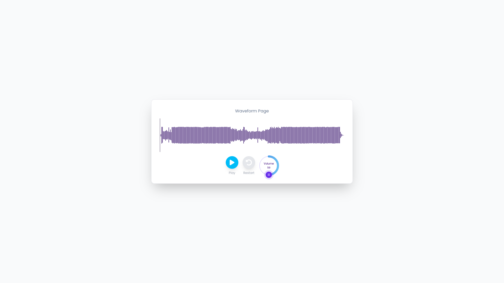

# Waveformer

A simple React application that displays a waveform of an uploaded audio.

## Features

- Upload audio files with a sleek modern UI
- Playback uploaded audio media
- View waveform of uploaded audio (Generated
  by [WaveSurfer](https://wavesurfer.xyz/))

## Development Setup

_This project uses `yarn` as the dependency manager_

- Clone this repository
- Install dependencies using `yarn install`
- Start the development server `yarn dev`
- Open app at http://localhost:3000

## Screenshots

## Author

- [Kwame Opare Asiedu](https://github.com/kwameopareasiedu)
